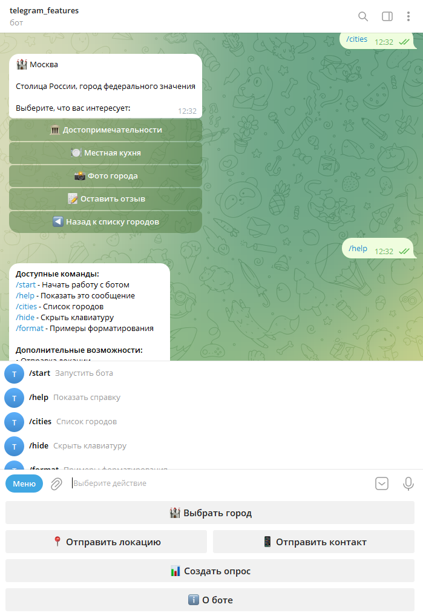

# Telegram Бот-Гид по городам 🏰

Этот бот демонстрирует различные элементы Telegram UI и представляет собой простого гида по городам России.



## ✨ Функциональность

- 🎯 Основное меню с кнопками
- 🔘 Inline-кнопки для навигации по городам
- 🏛 Информация о достопримечательностях
- 🍽 Информация о местной кухне
- 🔄 Удобная навигация между разделами

## 🚀 Быстрый старт

1. **Клонируйте репозиторий**

   ```bash
   git clone <repository-url>
   cd telegram_ui
   ```

2. **Создайте виртуальное окружение**

   ```bash
   python -m venv venv
   source venv/bin/activate  # для Linux/Mac
   venv\Scripts\activate     # для Windows
   ```

3. **Установите зависимости**

   ```bash
   pip install -r requirements.txt
   ```

4. **Настройте переменные окружения**
   - Скопируйте файл `env.example` и переименуйте его в `.env`
   - Откройте файл `.env` и замените `your_bot_token_here` на ваш токен
   - Подробная инструкция по получению токена находится в файле `env.example`

## 🤖 Команды бота

| Команда   | Описание               |
| --------- | ---------------------- |
| `/start`  | Запустить бота         |
| `/help`   | Показать справку       |
| `/cities` | Список городов         |
| `/hide`   | Скрыть клавиатуру      |
| `/format` | Примеры форматирования |

## 🎮 Интерактивные элементы

Как видно на скриншоте выше, бот предлагает удобный интерфейс с:

- Основной клавиатурой для быстрого доступа
- Inline-кнопками для навигации по городам
- Форматированными сообщениями
- Интерактивными элементами для взаимодействия

## 📱 Запуск

```bash
python bot.py
```

## 🔒 Безопасность

- Храните токен только в файле `.env`
- Не публикуйте токен в публичном доступе
- Используйте `/revoke` в @BotFather при компрометации токена

## 🤝 Вклад в проект

Если вы хотите внести свой вклад в проект:

1. Сделайте форк репозитория
2. Создайте ветку для ваших изменений
3. Отправьте пулл-реквест

## Структура бота

- Основное меню с кнопками выбора города и информации о боте
- Для каждого города доступна информация о:
  - Достопримечательностях
  - Местной кухне
- Удобная навигация с возможностью возврата к предыдущему меню
